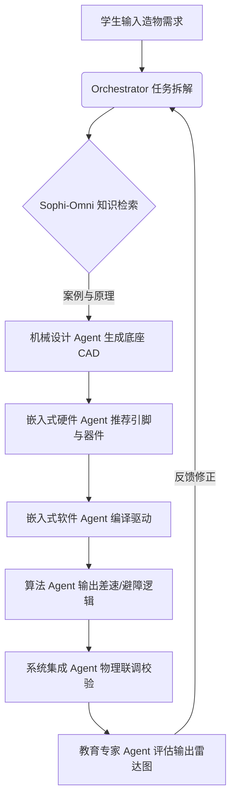

# 移动机器人软硬件集成课程 (AI & ROS 2)

> **主题：教给孩子 AI 时代的生存逻辑，培养 AI 时代的科创人才**

---

## 🏗️ 页面架构说明

| 层级 | 技术方案 | 描述 |
|---|---|---|
| **课程首页** | VitePress Markdown（当前页面） | 提供课程定位、核心能力、软硬件选型、双组大纲及多智能体协作等高阶信息展示 |
| **技术细节文档** | VitePress 静态子站点 | 点击各章节链接跳转，提供深度技术理论、实验指南与代码示例 |

---

## 📌 1. 课程定位

**时代之变（Why）：** 2023 年人类步入 AI 原生时代，传统的编程与制造门槛正被全面降维。未来科技人才的核心壁垒，不再是死记硬背的底层语法和机械接线，而是**定义真实需求、驾驭 AI 工具进行系统性决策**的能力。

**方法之新（How）：** 本课程独创性地融合 **开源造物精神（FabLab）、项目式学习（PBL）与工业级 AI 敏捷工作流**。通过"硬件统一，AI 赋能"的超级工程放大器，赋能学生跨越跨学科技术鸿沟，完成从"工具使用者"到"物理世界创造者"的蜕变。

**成果之硬（What）：** 课程以国家高素质科创人才鉴定标准为导向。通过对比 3 种以上 AI 方案、BOM 成本优化和 DFM 审查，引导学生打造出打通"端-网-云"的具身智能机器人以及工业级开源作品集，为国内强基综评与海外顶尖名校申请做储备。

### 1.1 核心能力培养

在这个过程中参与者将共同解决真实工程问题，从而培养以下核心能力：
* **需求提出与定义**：精准描述痛点，翻译为机器可读的结构化需求。
* **AI 工具使用与工程化**：调度 LLM 编写代码、生成 CAD 脚本、执行 DFM 工艺审查。
* **辩证思考与决策**：在 AI 产出的多套备选方案中，权衡稳定性、成本与美学进行科学决策。
* **了解 AI 能力边界**：清晰识别哪些任务应交由 AI 快速生成，哪些任务必须由人类进行机理校验。
* **文档与复盘**：规范整理工程日志与 Git 提交链，沉淀可复用的开源技术资产。

---

## ⚖️ 1.2 教学差异对比

为了保证 AI Native 教学效果，课程严格执行以下教学规范：

| 🔴 禁止行为（绝对不允许出现） | 🟢 标准行为（必须严格执行） |
|---|---|
| ❌ "今天我们来学习 Python 语法，然后写一个控制机器人的代码" | ✅ "你的机器人需要实现自动避障功能，现在告诉 AI 你的需求，它会给你 3 种避障方案" |
| ❌ "大家打开 Fusion 360，跟着我画一个底盘模型" | ✅ "AI 已经生成了 3 个底盘模型，你需要从稳定性、重量、美观度三个维度选一个最好的" |
| ❌ "这个电路的原理是这样的，大家按照这个图接线" | ✅ "AI 已经画好了电路图并生成了接线教程，你按照教程接线，有问题直接问 AI" |

---

## 🎯 1.3 招生学员画像

* **基础门槛**：具备一定的英语、科学、基础编程或机器人操作经验。
* **招收年龄**：初一、初二、高一、高二。
* **核心兴趣**：对人工智能、具身智能、产品创新及硬核科技竞赛有浓厚探索欲的初高中生。
* **核心诉求**：有国内升学（强基计划、综合评价、科创特长）或海外顶尖名校申请需求，渴望建立一套含金量极高、真正符合工业标准的个人项目作品集。

---

## 🛞 1.4 模块化硬件底盘演进 (Sophilab 移动载荷)

课程基于统一的标准件和参数化设计框架，提供 5 种不同侧重点的 AGV（自动导航车）硬件底盘设计概念供评估与迭代：

| 方案编号 | 核心概念 (Option) | 关键设计细节 (Key Design Ideas) | 交互特征与功能 | 最佳适用场景 |
|:---:|---|---|---|---|
| **Option 1** | **基础模块化 3030 框架** (Basic modular 3030 frame) | • 3030 铝型材骨架 • FDM 3D打印连接件 • 模块化顶板 • 树莓派安装区 | 纯机械组装，电机安装与基础底盘结构理解。 | 极速原型搭建 / 基础 AGV 套件 |
| **Option 2** | **教育控制面板版** (EDU control panel version) | • 蓝白黑拼色 FDM 外壳 • 前置按钮控制面板 • LED 状态指示灯条 • 可拆卸侧板 | 启动/暂停/停止实体按键，LED 状态反馈，易于模块识别。 | 高中课堂交互与动态展示 |
| **Option 3** | **STEM 传感器实验版** (STEM sensor version) | • 树莓派多位置挂载点 • 超声波防撞传感器 • 云台相机支架 • 传感器塔架结构 | 软硬件独立编程，AI、物联网及传感器融合实验。 | 传感器开发与树莓派视觉项目 |
| **Option 4** | **编程反馈版** (Coding feedback version) | • LED 点阵屏幕 • 编码器反馈按钮 • 前置碰撞杠 • 随车工具架 | 直观的 LED 点阵显示，随车控制调试，适合开放式硬件开发。 | 逻辑算法编写与创客空间活动 |
| **Option 5** | **终极麦克纳姆轮全向版** (Final combined omni version) | • 铝型材与 FDM 混合结构 • 麦克纳姆全向轮 • 快速拔插传感器模块 • 前置多功能控制面板 | **360° 全向移动控制**，多传感器硬件联动，集成式电源管理系统。 | **终极具身智能 Sophi-Core 概念** |

> **🏆 推荐研发方向（Recommended Final Direction）：** 
> 采用 **Option 5** 作为主攻路线。使用 3030 工业铝型材框架保证高刚性，麦克纳姆轮实现全向零半径转向，配合蓝白黑三色 CMF 工艺打样外壳，集成物理启动/暂停按键、超声波避障、广角相机，并可选配激光雷达。

---

## 📋 2. 课程大纲

### 🟢 2.1 初中组：AI 机器人产品体验营
> **核心理念：** `"AI 做所有事，学生只做决策"`

| 天数与主题 | 上午内容 | 下午内容 | 核心工具 | 交付产出 |
|---|---|---|---|---|
| **第一天** 问题挖掘 | • **主题分享**：FabLab 精神、AI 时代软硬件开发流程与产品经理思维定义小车。 | • **团队组建**：构建“双人精锐组”，飞书看板项目管理入门。 • **概念探索**：定义产品核心功能，AI 辅助起名、Slogan 与文生图脑暴。 | 通义千问/Kimi/DeepSeek/豆包、飞书看板 | 小组问题分析报告、创意脑暴海报、基础 PRD 草稿 |
| **第二天** 功能定义 | • **概念设计**：模块化部件认知（学生做 100% 决策）。 • **提示词工程**：学习目标-要求-约束三要素向 AI 提需求。 | • **行为流定义**：AI 自动生成用户交互逻辑图。 • **软硬件选型**：AI 推荐最优硬件清单。 • **Vibe Coding**：在 AI 指导下部署 VSCode 并快速生成项目介绍网页。 | VSCode/lingma、文生图工具、Gitee | 工业标准 PRD 文档、硬件选型清单、项目发布网页 |
| **第三天** 参数化设计 | • **设计规范**：学习工业级 CMF 与 DFM（可制造性设计）规范，理解“为加工而设计”。 | • **模型终审**：通过 `sophicar.com` 网页端进行参数化底盘滑块设计，三维度横向评估。 • **数字化加工**：操作 3D 打印机/激光切割机加工实物。 | `sophicar.com`、Fusion 360 AI 脚本、MakerLab | `.stl` 格式三维结构模型、数字化加工参数文档、物理底盘零件 |
| **第四天** 嵌入式基础 | • **引脚认知**：建立对 ESP32-S3 开源硬件全局认知，专注于懂逻辑而不死记硬背。 | • **虚拟仿真**：在 Wokwi 平台完成接线验证。 • **自然语言编程**：学生用自然语言描述运动需求，AI 自动生成控制逻辑与固件烧录。 | Wokwi 仿真平台、Aily Blockly、ESP32-S3 核心板 | Wokwi 仿真模型、ESP32-S3 控制代码、第一台通电运行的物理样机 |
| **第五、六天** 软硬件调试 | • **整机总装**：动手组装外壳与传感器支架，指挥 AI 生成数字化装配步骤教程。 • **工艺优化**：整理杂乱电路，AI 生成理线规范，杜绝“飞线”。 | • **控制重构**：用自然语言描述深层控制（传感器融合、避障逻辑），由 AI 编译。 • **总线调优**：调试主控板与电机、舵机间的 CAN 总线/串口通信。 | VSCode、万用表、CAN 总线扩展模块 | 车辆避障算法代码、硬件测试报告、工业级布线避障机器人 |
| **第七天** 全栈 Vibe Coding | • **零代码界面**：跳过前端 UI 代码，通过纯自然语言与 AI 对话编译出美观的 HTML 网页交互控制面板。 | • **跨网控制**：配置 Wi-Fi/蓝牙协议，将网页端控制面板与小车主控板长连接跨网桥接。 | HTML5/CSS/JavaScript 零代码生成器、本地 Wi-Fi 模块 | 跨平台前端控制网页源码、AI 交互控制接口文档、无线交互终端 |
| **第八天** 多模态交互 | • **交互赋能**：描述多模态工作流需求，指挥 AI 将语音控制、视觉识别与避障算法合并，全自动生成集成系统代码。 | • **联调测试**：实现“听到指令出发、看到特定障碍物精准刹车/倒垃圾”的智能化逻辑。 | Qwen VLM、Hugging Face、Aily Blockly | 完整合并的交互控制逻辑代码包、全功能集成演示视频 |
| **第九天** 数字孪生 | • **孪生认知**：理解“虚拟仿真 &rarr; 实体部署”系统集成，由 AI 辅助驱动 3D 虚拟车物理引擎。 | • **虚实联动**：高频双向同步逻辑部署，实现“滑块调整/物理移动 &rarr; 虚拟 3D 屏幕车动画同步”。 | Three.js 3D 渲染引擎、数据双向同步智能体 | 3D 数字孪生仿真控制系统源码、端-网-云-虚拟仿真演示系统 |
| **第十天** 轻量化优化 | • **系统集成**：全功能饱和压力测试，优化控制参数。 • **结构优化**：向 AI 提出轻量化拓扑需求，进行减重应力分析并微调机械结构。 | • **工艺定型**：最后一轮理线与质检，AI 辅助撰写产品说明书。 | VSCode、Autodesk Fusion 360 Generative Design | 最终版多模态综合控制代码、产品拓扑优化说明书、终极物理原型机 |
| **第十一天** 包装测试 | • **系统压测**：开展“端-网-云-虚拟仿真”完整闭环压力测试，优化文档与日志。 | • **开源整理**：整理 Gitee/GitHub 代码仓库，规范文档与演示视频。 | Git/GitHub Pages、Markdown 编辑器 | 规范开源的 GitHub 技术仓库、定量分析图表、学术型技术报告 |
| **第十二天** 产品发布 | • **路演路演**：正式举办产品发布会，各小组轮流进行 5 分钟技术路演 + 5 分钟评审团 Q&A。 | • **企业参访**：企业专家演讲与答辩证书颁发。 | 投影仪、路演 PPT | 创新技术讲解视频、联合认证结营证书、带走个人物理机器人 |

---

### 🔵 2.2 高中组：AI 具身智能产品工程营
> **核心理念：** `"AI 做基础执行，学生做系统设计和深度决策"`

#### 💡 高中组与初中组的本质区别
1. **多智能体协同（Multi-Agent Workflow）**：打破“输入提示词、生成单点结果”的线性黑盒体验，全面引入“专家智能体编排体系”，学生通过状态机协同调度多个专项 Agent（机械、硬件、代码、算法）。
2. **白盒机理剖析**：完美调和传统代码/电路硬核数理公式与 AI 零代码降维工具的冲突。独创 **“AI 生成复杂要素 &rarr; 学生进行白盒机理剖析 &rarr; 仿真验证 &rarr; 物理实操重构”** 的逆向工程流，释放 70% 的低价值琐碎时间，让学生专注于**运动学反解、有限状态机构建及全局技术拓扑**的设计与推导。
3. **学术级诚实性交付**：拒绝流水账式的传统日记。学生最终交付必须包含**数理公式推导、定量分析图表、Git Commit 全留痕证据链**的学术型开源作品集，精准对齐强基综评标准。

#### 📋 高中组核心大纲补充
* **Day 1-2：痛点深度挖掘与专利分析**：引入联合国可持续发展目标（SDGs），利用 AI 进行行业级专利检索与分析，从现有竞品中提炼技术壁垒，形成高级商业可行性与市场规模分析报告。
* **Day 3-4：工业级 BOM 与 DFM 深度审查**：引导学生利用 AI 智能体对机械底盘进行三维模型多维度纵向评估，编写结构优化与应力分析文档；自动生成多级 BOM（物料清单）并进行供应链采购成本优化。
* **Day 5-6：运动学反解推导与多路总线通信**：深入 ESP32-S3 与算能 Duo 芯片架构，推导双轮差速/麦轮运动学矩阵，在 Wokwi 中进行逻辑校验；打通 CAN 总线与串口通信，实现机械臂多轴协同控制。
* **Day 7-8：跨网控制与边缘视觉 VLM 部署**：基于 MQTT/WiFi 部署高频双向通信，利用视觉语言模型（Qwen VLM / YOLO）将多模态提问（语音、画面）深度转化为机器人的结构化 JSON 动作指令流。
* **Day 9-10：三维数字孪生与生成式拓扑优化**：基于 Three.js 自主设计双向虚实联动仿真控制面板，配合 Fusion 360 Generative Design 进行车身结构轻量化迭代。
* **Day 11-12：学术答辩与开源发布**：生成规范的 README、技术拓扑图，进行系统级端-网-云压力测试，举行全英文学术路演。

---

## 🧠 3. 专家 Agent 协同体系 (Sophi-Core Orchestration)

本课程的核心特色是引入了工业级的多智能体（Multi-Agent）开发架构，将复杂的工程任务解耦，由不同的专家 Agent 协同学生完成研发：

### 3.1 专家智能体角色分工

| 智能体角色 | 核心关注点 (R&D Focus) | 夏令营协同任务 (Camp Role) |
|---|---|---|
| **🎯 Orchestrator Agent** | 项目总协调与质量评估，负责任务拆解与全局监控。 | 接收学生需求，将其拆解为 9 维度子任务，调度专家集群。 |
| **⚙️ 机械设计 Agent** | 结构强度、减重优化、三维参数化建模。 | 结合 `sophicar.com` 为学生提供 3 套底盘方案进行决策。 |
| **🏭 机械制造 Agent** | DFM（可制造性）校验、BOM（物料清单）生成。 | 提供加工余量建议、3D 打印层厚指导及标准件零件清单。 |
| **🔌 嵌入式硬件 Agent** | 电路图生成、元器件选型、引脚冲突规避。 | 自动生成 Wokwi 仿真接线图及物理接线安全说明。 |
| **💻 嵌入式软件 Agent** | 驱动编写、底层总线配置、自然语言 Vibe Coding。 | 生成 ESP32-S3 底层固件代码，供学生审核与一键烧录。 |
| **🧠 算法专家 Agent** | 运动学反解、PID 调优、VLM 动作流解析。 | 提供差速/麦轮运动学公式推导框架，生成调参建议。 |
| **🔗 系统集成 Agent** | 总线协议调优、故障排查、物理整机联调。 | 在通电联调时，提供结构化的排故清单与接线诊断指南。 |
| **📈 产品与市场 Agent** | SDGs 关联性、竞品提炼、商业可行性。 | 辅助学生完善产品功能定义，提炼市场宣传 Slogan。 |
| **💰 商业与成本 Agent** | 供应链成本优化、盈亏平衡分析。 | 核算标准件采购成本，生成单车经济性分析报告。 |
| **🔬 研发与创新 Agent** | 前沿技术追踪、专利检索与技术壁垒分析。 | 协助学生利用大模型进行专利查新，撰写创新点描述。 |
| **🎓 教育专家 Agent** | 学习效果评估、心理与情绪监测、预警干涉。 | 基于北师大评价体系，全程记录学生表现，生成动态雷达图。 |

### 3.2 智能体底层逻辑 — "基于状态的编排" (State-Based Orchestration)

* **知识底座 Sophi-Omni** 采用：`自动采集 &rarr; AI 初筛 &rarr; 人工审核 &rarr; 注入 RAG` 的漏斗式更新逻辑，保证提供最前沿的 ROS2 与 AI 代码示例。
* **教育专家 Agent** 采用：`标准共建（北师大评价体系） &rarr; AI 初评 &rarr; 专家审计 &rarr; 动态课表调度 &rarr; 情绪与压力监测 &rarr; 综合能力评估 &rarr; 人机协作触发器` 闭环。

---

## 🏆 4. 课程产出与评估

### 4.1 核心交付物说明

* **实物项目**：学生亲手组装、接线、烧录并调试成功的第一台物理 AI 移动机器人（底盘 + 传感器套件）。
* **开源仓库**：规范的 GitHub/Gitee 开源资产，内含差速控制代码、Prompt 系统提示词配置、网页端交互源码及 3D 打印 `.STL` 结构文件。
* **学术工程日志**：**严禁流水账**。必须遵循科学记录格式：
  $$\text{[面对的工程问题]} \rightarrow \text{[原始数据/Bug 表现]} \rightarrow \text{[给 AI 的 Prompt 迭代]} \rightarrow \text{[AI 提供的解决方案]} \rightarrow \text{[物理世界验证结果与反思]}$$
* **Kickstarter 演示视频**：全英文/中文出镜讲解，阐述机器人的创新设计、核心算法推导逻辑以及多模态具身智能的演示。
* **学术型作品集**：包含详细数理公式推导（如运动学雅可比矩阵）及定量分析图表，支持 Git Commit 全留痕证据链。

### 4.2 团队角色理解 (PBL Role Mapping)

每个精锐双人组需明确以下分工与角色定位：
* **产品经理 (PM)**：负责场景定义、人机交互与功能定义。利用提示词工程撰写工业级 PRD，使用 AI 渲染工具进行外观迭代。
* **前端/交互工程师**：使用 HTML5/CSS/JavaScript 零代码生成器开发 Web 交互控制终端，部署长连接。
* **后端与算法工程师**：负责运动控制、路径规划算法调试，打通大模型 Agent 与小车底层硬件的通信接口。
* **嵌入式软硬件工程师**：主导硬件选型、接线 Wokwi 仿真验证，执行底盘物理接线与固件烧录。
* **机械工程师**：使用 AI 辅助设计物理底盘结构，操作 3D 打印与激光切割机，对齐传感器物理支架。
* **项目经理 (PJM) / 系统集成师**：维护飞书看板与甘特图进度，主导全系统软硬件集成联调，撰写排故日志。

### 4.3 评估报告维度与权重

课程采用多维度综合性评价体系，结营时输出详尽的评估雷达图：

| 评估维度 | 权重 (Weight) | 详细评估标准 (Criteria) |
|---|---|---|
| **AI 工具使用能力** | **25%** | AI 工具的使用深度与广度、提示词工程技巧、AI 辅助开发及 Debug 效率、生成内容的创新性。 |
| **FabLab 制造能力** | **25%** | 三维设计参数合理性、数字化加工设备操作熟练度、CMF/DFM 规范掌握、原型迭代速度与工艺品质。 |
| **项目完成度与创新性** | **30%** | 机器人的运动控制性能、多模态交互稳定性、解决真实痛点的实用价值、系统集成可靠度。 |
| **开源与协作精神** | **20%** | 技术文档及 PRD 完整性、代码注释与规范、Gitee/GitHub 仓库活跃度、Git Commit 提交留痕、团队协作表现。 |

---

## 🏛️ 5. 政策、比赛与场景应用

### 5.1 政策切入点

* **北京政策环境**：对接**高中综合素质评价（综评）**与**强基计划**。北京营联合北师大二级学院盖章颁发评估报告，内含量化雷达图、数理公式推导及专家二次审计，可直接对应高中综评系统中的“研究性学习记录”。
* **浙江政策环境**：对接**三位一体招生（综评）**。宁波营由联合国科创实验室（UNNC-BDO）组织，利用 UNNC-FabLab 印章背书，重点强调“算法到实物的闭环转化（Sim-to-Real）”和“Git 工业级版本控制”，极大提升面试含金量。

### 5.2 白名单赛事对接

课程产出可直接用于申报和参与以下教育部白名单及主流科创竞赛：
* **第九届全国青少年人工智能创新挑战赛**（教育部 2025-2028 学年白名单竞赛）
* 青少年科技创新大赛 / 全国青少年信息技术创新实践大赛（NOC）
* 全国大学生机器人大赛（RoboMaster/RoboCon，高校延伸段）
* “挑战杯”与“互联网+”大学生创新创业大赛（学术作品集积累）

---

## 📚 技术文档章节（VitePress 详情页入口）

点击以下章节即可跳转查看技术文档细节及实验指南：

### [第一章：机器人运动学与动力学建模](./theory.md)
- **核心理论**: 深入推导双轮差速底盘及麦克纳姆全向轮底盘的正逆解运动矩阵，理解航向估计（Odometry）和 Pure Pursuit 路径追踪。
- [点击查看运动学细节文档 &rarr;](./theory.md)

### [第二章：底盘控制链与微处理器集成](./hardware.md)
- **底层执行**: 学习增量式 PID 电机闭环控制原理，掌握算能 SophiGo Duo 的 GPIO/PWM/UART 引脚分配与防干扰电机驱动硬件设计。
- [点击查看控制与硬件集成细节 &rarr;](./hardware.md)

### [第三章：ROS2 导航与感知系统](./ros2.md)
- **中枢大脑**: 部署 ROS2 通信节点，广播车体 TF2 坐标变换，接入激光雷达并通过 Nav2 导航堆栈实现 SLAM 建图及自主避障规划。
- [点击查看ROS2导航系统细节 &rarr;](./ros2.md)

### [第四章：Sophicar 3D 在线仿真](./simulation.md)
- **仿真演练**: 利用 WebGL (Three.js) 在线渲染 Sophicar 精准车身 CAD 结构，通过网页虚拟遥控器及虚拟传感器射线在零硬件条件下验证控制程序。
- [点击查看Web 3D仿真细节 &rarr;](./simulation.md)

---

## 💬 划词批注互动区

本平台已集成**高保真本地划词评论系统**。如果您对运动学矩阵推导、引脚连线图或者 ROS2 节点通信存在任何疑问：
1. 请先在[主站首页](/)注册并登录。
2. 返回本页面，**用鼠标直接划选目标文字**，即可触发高亮批注面板进行提问或讨论。
3. 您的疑问将会显示在对应文本行下，助您与社区极客共同进步！
