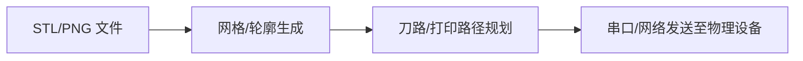

# Mods 快速原型编译器

Mods 是集成在 SophiGo 平台中的流式数字制造（Flow-based Digital Fabrication）节点编辑器。它允许用户将 CAD 图纸、G-Code 和电机轨迹以可视化的工作流形式相互连接与编译。

## 核心特性

- **图形化数据流**：通过直观的连线连接硬件输入、网格处理器与设备控制器。
- **跨平台硬件直连**：支持直接向 3D 打印机、激光切割机或小型 CNC 雕刻机发送进给指令。
- **高自由度扩展**：允许开发者通过 Javascript 编写自定义节点，扩展特定的算法模块。

## 典型节点工作流

---

> [!WARNING]
> 在执行硬件直连输出时，请务必确保设备周边环境安全，并提前进行空机测试以防止电机过载或意外碰撞。
